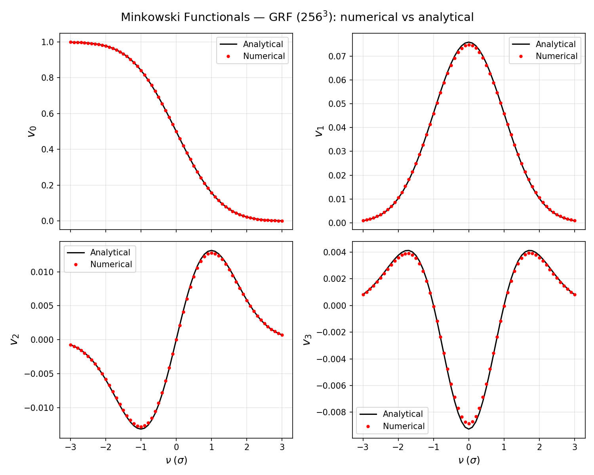

# pyMIN

## Introduction
A python code to calculate 3D Minkowski Functionals

Basically a rewrite of Liron Gleser's code, see https://arxiv.org/pdf/astro-ph/0602616

This code uses the Koenderink method to calculate the MFs.

### pyMIN.py (NumPy/Numba)

Enviroment requirement: numpy, numba and sympy. For sympy you can just substitude the levicivita function with a ndarray and abandon the sympy.

Function `calculateMFs` Calculate the 3D MFs ($V_{0}-V_{3}$) of a given field (must be 3D).

### minax.py (JAX)

**This part is not strictly tested**

A JAX-based reimplementation of pyMIN.py. All core functions are fully JIT-compilable and vectorised — no Python-level loops over voxels or thresholds.

Enviroment requirement: jax and matplotlib (for plotting only). No numba or sympy needed.

Function `calculateMFs` Calculate the 3D MFs ($V_{0}-V_{3}$) numerically via vectorised Einstein summations and cross products.

Function `analyticalMFs` Calculate the analytical MFs for Gaussian random fields, useful for validating the numerical results.

Function `make_thresholds` Generate threshold values in field units from sigma multiples.

Function `subtractWedge` Remove foreground-wedge modes in Fourier space (21-cm cosmology).

You can run `python minax.py` directly to generate a comparison plot of numerical vs analytical MFs on a $64^3$ standard Gaussian random field.

## Example (pyMIN)
Please download (only) pyMIN.py to one of the system paths. Or, you can download it to any folder and add that folder to system paths:
```
import sys
sys.path.append('~/where/you/download/the/script/')
```
Then you can import and calculate.
```
import pyMIN as pm
import numpy as np

data = np.random.normal((64,64,64))
v0,v1,v2,v3 = calculateMFs(data)
```

## Example (minax)
```
import jax
import jax.numpy as jnp
from minax import calculateMFs, analyticalMFs, make_thresholds

key = jax.random.PRNGKey(0)
data = jax.random.normal(key, shape=(64, 64, 64))

# Numerical MFs (thresholds in field units)
thresholds = make_thresholds(data)
v0n, v1n, v2n, v3n = calculateMFs(data, thresholds)

# Analytical MFs (thresholds in units of sigma)
nu = jnp.linspace(-3, 3, 61)
v0a, v1a, v2a, v3a = analyticalMFs(data, nu)
```

Comparison of numerical vs analytical MFs on a $256^3$ standard Gaussian random field:



## Citation
Please also consider cite [Diao et al. 2024](https://iopscience.iop.org/article/10.3847/1538-4357/ad6c40/meta)
```
@ARTICLE{2024ApJ...974..141D,
       author = {{Diao}, Kangning and {Chen}, Zhaoting and {Chen}, Xuelei and {Mao}, Yi},
        title = "{Reionization Parameter Inference from 3D Minkowski Functionals of the 21 cm Signals}",
      journal = {ApJ},
     keywords = {Cosmology, Reionization, H I line emission, Markov chain Monte Carlo, 343, 1383, 690, 1889, Astrophysics - Cosmology and Nongalactic Astrophysics},
         year = 2024,
        month = oct,
       volume = {974},
       number = {1},
          eid = {141},
        pages = {141},
          doi = {10.3847/1538-4357/ad6c40},
archivePrefix = {arXiv},
       eprint = {2406.20058},
 primaryClass = {astro-ph.CO},
       adsurl = {https://ui.adsabs.harvard.edu/abs/2024ApJ...974..141D},
      adsnote = {Provided by the SAO/NASA Astrophysics Data System}
}
```
